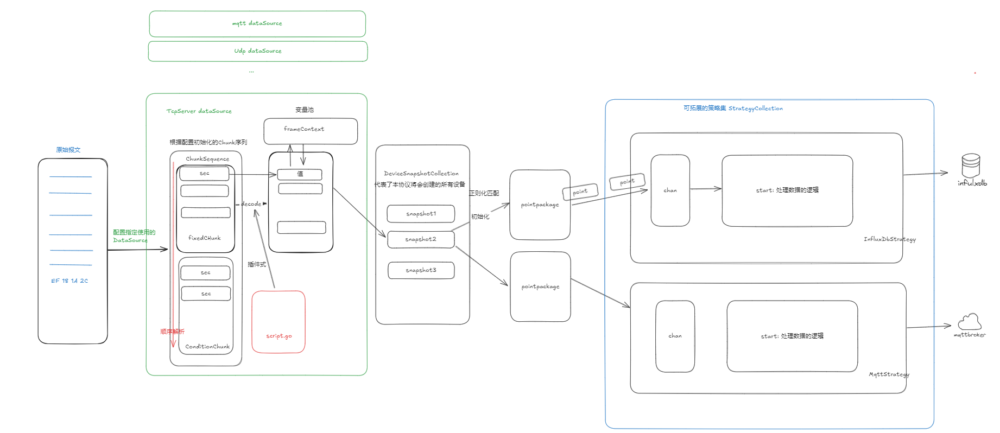

## Intro

一个零代码、完全依赖配置驱动的数据网关。

示意图：



## DataSource 数据源

拟支持多种类型的数据源
- Json类型数据源
    - Mqtt (正在编写...)
    - Kafka
- Byte类型数据源
    - TcpServer (作为TcpServer接收报文) (已完成)
    - TcpClient (作为TcpClient主动fetch报文)
    - UdpServer (作为TcpServer接收报文)
    - UdpClient (作为UdpClient主动fetch报文)
- Protobuf (?)
- Sql 通过轮询sql获取数据
  - oracle
  - mysql
  - postgres
- 其他形式数据源

dataSource 仅需要满足两点：
- 接收数据
- 转换为deviceSnapshot的
所以可以无限扩展

## Parse 解析

不同数据源解析逻辑不同，共有思路是通过读取配置的解析流程，灵活的对不同协议进行解析。

以Tcp Byte为例：

特点：Tcp协议需要指定包的起始与末尾，需要有一份配置文件指示报文中的偏移量和解码逻辑。

实现思路：

1. 完整的报文可以拆分为多个堆叠的Chunk组成的ChunkSequence，每个Chunk中可以有多个Section。会在后续流程中顺序解析。

   - FixedLengthChunk （定长Chunk） 用于可以确定整个报文长度的协议
   - ConditionalChunk （条件Chunk） 用于需要通过上下文得知协议类型后的动态Chunk
   - DelimiterChunk (分隔符Chunk) 用于通过固定的帧头帧尾分隔符指示报文结尾的Chunk
   - DynamicChunk (不定长Chunk) 以上Chunk所需信息都没有，只能完全依赖Section解析的动态Chunk（性能有所降低）
2. 每个Chunk中理应维护一个Section数组，一个Section为一个最小的不可分割的部分，它指示了几个字节长度的解析生命周期的完整逻辑，结构如下：
    ```go
    // SectionConfig 定义
    type SectionConfig struct {
        From     FromConfig `mapstructure:"from"` // 偏移量
        Decoding Decoding   `mapstructure:"decoding"`
        For      ForConfig  `mapstructure:"for"`  // 赋值变量
        To       ToConfig   `mapstructure:"to"`   // 字段转换配置
        Desc     string     `mapstructure:"desc"` // 字段说明
    }
    ```
- From 数据来源
  ```go
  type FromConfig struct {
      Byte   int         `mapstructure:"byte"` // 字节长度
      Repeat interface{} `mapstructure:"repeat"` // 重复次数
  }
  ```
- Decoding 数据解码
  ```go
   type Decoding struct {
       Method string `mapstructure:"method"` // 方法名，定义在./script下
   }
  ```
- To 数据去向
  ```go
   type ToConfig struct {
       DeviceName string   `mapstructure:"device"` // 目的设备名称
       DeviceType string   `mapstructure:"type"`   // 目的设备类型
       Fields     []string `mapstructure:"fields"` // 目的字段名
   }
   ```

总之，通过内部的动态执行的特点，外部仅需要配置：
1. 数据从哪几个字节来
2. 数据如何解码
3. 数据去向
就可以完成字节流数据的解析

以上只是Tcp类型的解析逻辑展示，udp不需要控制帧头与帧尾，内容会简单的多。
json只需要配置字段转换规则即可。

## varField 动态化变量

协议中有这样的场景：

场景1：
...
- 第67个Section解析内容变量
- 第68个Section需要重复n次，重复次数为第67个块解析的值

场景2：
...
- 第10个Section解析内容变量
- 后续的Chunk需要根据第10个Section的内容来指示帧类型

场景3：
...
- TcpServer Fetch到了一条tcp连接
- 创建的设备快照名称需要根据配置好的TcpIp花名对照表来动态生成名字
  - 例如：根据配置，ip 10.17.191.100 代表了集中站第1号电源屏
  - 后续需要根据电源屏id来动态创建设备快照名：例如power0001

由于协议的标准不统一的特点，这样变量的动态化解析是通用网关实现的难点所在。本项目通过一个变量池解决了该问题，实现思路如下：

变量池（帧上下文）定义为：
```go
type FrameContext map[string]*interface{}
```
原则为：
- 上下文的生命周期为一帧发送结束时。
- 变量可在任意时间赋值，但是赋值后，必须只能在后面的帧解析流程中使用。例如：在第65Section中，解析出了变量repeatTimes，在(66, ∞)的帧解析流程中都可以使用。**否则会引起空指针问题**。其实很好理解，变量还未解析出来，怎么使用？

回到上面的例子，看变量池如何解决这三个问题：

场景1：
...
- 第67个Section解析内容变量，解析后的值放入Context中，变量名为RepeatTimes
- 第68个Section需要重复n次，重复次数为RepeatTimes的值

场景2：
...
- 第10个Section解析内容变量，放入Context中，变量名为FrameType
- 后续的Chunk需要根据FrameType值来指示帧类型

场景3：
...
- TcpServer Fetch到了一条tcp连接
- 创建的设备快照名称需要根据配置好的TcpIp花名对照表找到其花名，放入Context的DevId中
- 创建快照流程，将设备名称拼接DevId即可

在配置中只需要这样指定：
- 通过for字段指示该字段放入哪些变量名之中
- 受Kotlin启发，使用${}模板字符串即可使用上文中的变量名

例：
```yaml
  - from:
      byte: 1
      repeat: ${RepeatTimes}
    decoding:
      method: "DecodeByteToLittleEndianBits"
    for:
      varName:
        - type
```

## Script 脚本

上述Decoding字段仅配置了解码函数名称，真正的函数实现追加到./script下的script.go下即可。
该目录会挂载到容器内部，程序启动后，会智能读取协议中用到的函数名称进行动态调用。

所有脚本仅需要实现如下接口即可：
```go
type ScriptFunc func([]byte) ([]interface{}, error)
```

解析后的`[]interface{}list`会和配置中的field或是varName一一匹配

## DeviceSnapshot 快照
快照即为`物模型在某时刻的状态`，其被时间戳驱动。本网关的过程即为通过不断创建新的设备快照，每个设备快照根据配置会发往不同的终点。

而iot后续的监控流程也是通过无数个快照还原设备的现实状态。

一个设备快照：
```go
// DeviceSnapshot 代表一个设备的物模型在某时刻的快照
type DeviceSnapshot struct {
	id         uuid.UUID                // 设备 ID
	DeviceName string                   // 设备名称，例如 "vobc0001.abc"
	DeviceType string                   // 设备类型，例如 "vobc.info"
	Fields     map[string]*interface{}  // 字段存储，key 为字段名称，value 为字段值
	PointMap   map[string]*PointPackage // 数据点映射，key 为策略名称，value 为数据点，仅为了方便查找
	Ts         time.Time                // 时间戳
}
```

本项目中将数据的去向称为`Strategy`，代表数据后续的处理与发送策略。
上面快照中其他字段很好理解，着重讲解PointMap。

有时我们的下游数据源不止有一个，例如，网关可能有这样的需求：
- 某些设备属性信息，放入kafka，用于其他服务
- 遥测信息发往mqtt的某话题之中
- 一些协议中不常变动的版本信息，存入关系型数据库

也就是Snapshot与Strategy并不是1-1对应的，我们需要一个指示器指示哪些字段需要使用哪些Strategy。 PointMap就是这个作用，但是这里并不需要自己维护该指示器，只需要在配置文件中的filter字段中这样指定：

不用担心同样的数据会因为多个策略而赋值多次增大开销，PointMap存入的是Fields中字段值的指针，会完全跟随字段值的变化而同步变化。

## Strategy 策略

策略的配置也非常简单，只需要通过语法：

拟支持的策略有：
- influxdb （已完成）
- iotdb (Todo)
- sql
- mqtt
- kafka
- mq
- redis
- prometheus + grafana 可视化网关设备参数
- 其他策略

```yaml
strategy:
  - type: influxdb
    enable: true
    url: http://10.17.191.107:8086
    token: mK_0NkLVPW8THIYkn52eqr7enL6IinGp8d5xbXizO1mVxAEk_EuOFxZ9OKWYcwVgi2XmogD6iPcO9KQ8ToVvtQ==
    org: "byd"
    bucket: "test"
    batch_size: 2000
    filter: # 格式<设备类型>:<设备名称>:<遥测名称>
       - ".*:.*:.*"
       - ".*:vobc.*:RIOM_sta_3"
    tags:
      - "data_source"
  - type: mqtt
    enable: false
    url: tcp://
    topic: "sam"
    filter: # 格式<设备类型>:<设备名称>:<遥测名称>
      - ".*:.*:.*"
```

filter完全采用正则语法，在字段更新时会自动检测是否符合所有过滤器。遵循

```<设备类型>:<设备名称>:<遥测名称>```

的格式即可，例如：

```".*:vobc.*:RIOM_sta_3"```

表示：
- 所有设备类型
- 所有以“vobc.”为开头的设备名称
- 所有遥测名称为RIOM_sta_3的字段

会发往InfluxDb之中，并且一个字段可以发往多个数据源。例如上述配置同时发往了mqtt与InfluxDb之中

所有策略需要实现两个接口即可完成拓展：
  
```go
// SendStrategy 定义了所有发送策略的通用接口
type SendStrategy interface {
	Start() // 启动策略监听
	GetChan() chan *Point // 提供访问 chan 的方法
}
```

## 使用
项目打包为镜像后，仅需要通过配置来指定所有流程。