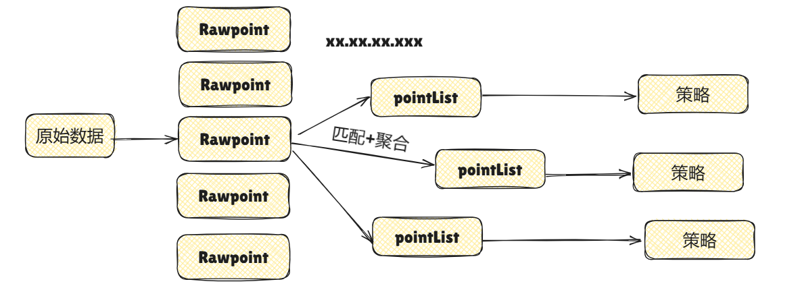

# GoGate

> 一个零代码、完全依赖配置驱动的数据网关。


# Quick Start

---
```shell
docker run -d -v /path/to/config.yaml:/config.yaml -v /path/to/script:/script -v /path/to/log:/log -p 8080:8080 gogate:latest
```

# How to Use

---
#### Step.1 明确数据源（Connector）

---
支持多种类型的数据源
- Message 类型数据源
    - Mqtt
    - Udp
    - Sql (todo)
    - Kafka (todo)
- Stream 类型数据源
    - TcpServer
    - TcpClient
  
#### Step.2 明确解析流程（Parser）

---
核心逻辑是，将数据源中的数据转为Point, Point为一个数据点，其定义很简单。
```go
type Point struct {
    Device string                 // 设备标识
    Field  map[string]interface{} // 字段名称
    Ts     time.Time              // 时间戳
}
```
受Iotdb启发， 设备标识遵守vobc.vobc0001.speed的格式。

假设有两个设备：
- vobc.vobc0001
- vobc.vobc0002
他们有相同的主设备vobc
#### Step.3 明确数据去向（Strategy）

---
支持多种数据发送策略，例如：
- InfluxDb
- Iotdb
- Mqtt
- Promethues
- Udp (Todo)

数据源与策略是**一对多**的关系，一个数据源可以有多个策略。

# Example
假设有一个TcpServer数据源，其有数据FF(1111 1111)需要将数据解析后发送到InfluxDb与Mqtt, 配置如下：
```yaml
connector:
  type: tcpserver
  config:
    url: :8080
    
parser:
  type: ioReader
  config:
    dir: ./script # 脚本路径
    protoFile: proto-train2sam-v0.0.1 # 启用哪一份协议
    
strategy:
  - type: influxdb
    enable: true
    filter: 
      - ".*"
    config:
      #    以下是自定义配置项
      url: http://10.17.191.107:8086
      token: mK_0NkLVPW8THIYkn52eqr7enL6IinGp8d5xbXizO1mVxAEk_EuOFxZ9OKWYcwVgi2XmogD6iPcO9KQ8ToVvtQ==
      org: "byd"
      bucket: "test"
      batch_size: 2000
      tags:
        - "data_source"
  - type: mqtt
    enable: false
    config:
      url: tcp://
      clientID:
      username:
      password:
      willTopic: "status/gateway"
```
另需一份协议配置， 这里键名和上面Profile对应上即可：
```yaml
proto-train2sam-v0.0.1:
  chunks:
    - type: FixedLengthChunk # 定长Chunk
      length: 1 # 长度(字节)
      sections: # 一个Chunk有多个Section
        - from: # from -- 数据来源
            byte: 1  # Section长度 (字节)
          decoding: # decoding -- 数据解码
            method: "DecodeByteToBigEndianBits" # 解码方法名, 定义在./script下， 反射读取
          to: # to -- 数据去向, 映射到Point的信息
            device: "vobc.status"  # 设备名称
            fields: # 字段 , 数据从from中拿出，经过decoding解析为list，映射到fields中
              - RIOM_sta_1 
              - RIOM_sta_2
              - RIOM_sta_3
              - RIOM_sta_4
              - RIOM_sta_5
              - RIOM_sta_6
              - RIOM_sta_7
              - RIOM_sta_8 # 可简写为RIOM_sta_{1..8}
```

随后可以通过cli工具测试配置和解析流程，验证：
```shell
gogate-cli
```
验证FF解析结果是否正确: 
 

# Design

---


## Pipeline

主流程从pipeline开始，通过配置自动构造四个模块。得益于工厂模式设计，三个模块均符合开闭原则，可以方便的拓展及测试。

### Connector

减少了网关样板代码的编写，对数据源的读取进行了封装，提供了统一的接口，方便后续的拓展。特点：

- 有统一的超时重连机制
- 有BufferPool的应用
- 统一简洁的日志输出

### Parser

负责从Connector中读取数据，解析后生成Point。Parser的设计思路是：
1. 区分流数据(Stream)和离散数据(Message)，但是其声明是自动化的保证使用者使用时是无感的
2. 解析规则可拓展可配置，可实现配置+脚本方式，0代码编写解析流程
3. 可通过Cli工具测试解析流程


### Aggregator

由于Section（配置中的一个解析单元）和Point是一一对应的，在使用时会有诸多不方便的地方，受到 [Telegraf](https://www.influxdata.com/time-series-platform/telegraf/) 启发， Aggregator具有以下职责：
  
- 聚合：将从Parser中解析的一帧数据(Frame)中的原始Point(rawPoint)按设备名称聚合并暂存，减少后续发送IO
- 路由: 将不同Point按策略中匹配的正则规则路由至正确的发送策略管道中
- 解耦: 分离了parser与Strategy模块，分担了Parser职责，自此Parser和Connector不必再是一对一的，减少开销



### Strategy

策略模块负责将Point发送至目标：

- 减少样板代码编写。可配置限流、过滤等策略。
- 通过正则方式匹配Point，避免繁琐的编写。例如，"vobc.*"即可匹配所有vobc开头的设备。


## 测试
单元测试在对应软件包下，集成测试统一在_test/目录下。


